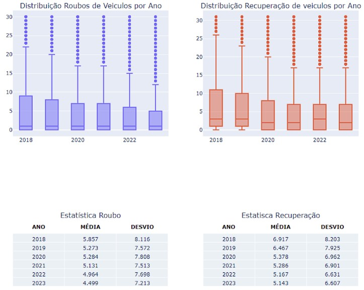

# 🚗 Vehicle Theft and Recovery Analysis (Rio de Janeiro - Brazil)

This project presents a visual and statistical analysis of **vehicle theft and recovery data** in the state of **Rio de Janeiro (Brazil)** from 2018 to 2023, using public data provided by the **ISP-RJ (Public Security Institute)**. The goal is to understand distribution trends and year-over-year averages using interactive visualizations.

**Sampling:**
A top 10% cutoff was applied to the values of each year to mitigate the impact of outliers. It is worth noting that, since the mode of the theft data is 1, no lower-end trimming was necessary.

**Distribution Analysis:**
A downward trend in vehicle theft cases is observed, with the overwhelming majority of records indicating only one victim per incident. Regarding recovery data, changes have been minimal over the past three years but consistently remain higher than theft numbers.

**Statistical Analysis:**
The data is highly concentrated around the mean, as standard deviation values are very close to the averages. This pattern remains consistent across all years, indicating stability in the trends of vehicle theft and recovery.

  

---

## 📊 What It Does

- Loads public data from ISP-RJ
- Filters and trims outliers from vehicle theft and recovery reports
- Displays:
  - Boxplots of theft and recovery distributions (2018–2023)
  - Summary tables with **mean** and **standard deviation** per year

---

## 📦 Dataset

The dataset is sourced directly from:

**[ISP Dados RJ - BaseDPEvolucaoMensalCisp.csv](http://www.ispdados.rj.gov.br/Arquivos/BaseDPEvolucaoMensalCisp.csv)**  
Encoding: `ISO-8859-1`  
Delimiter: `;`  
Decimal separator: `,`

Filtered columns used:
- `ano` (year)
- `roubo_veiculo` (vehicle theft)
- `recuperacao_veiculos` (vehicle recovery)

---

## 🛠️ Tech Stack

- Python 3
- pandas
- plotly
